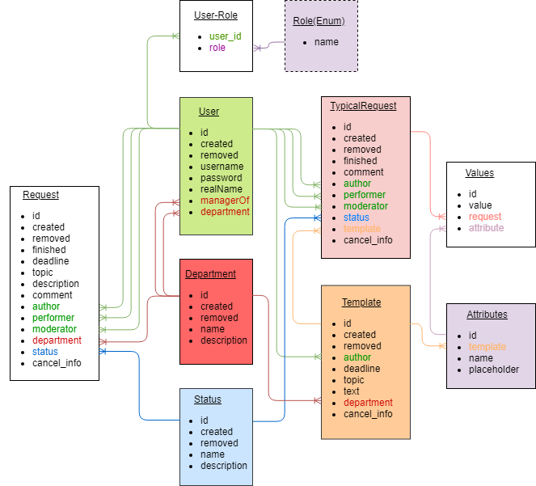

# Pulpo
An extensible application for generalization and automation of the process of solving problems of employees.
## General description

The main idea of the project is to create a single interface and a handler for all corporate problems that may arise from an employee, whether it is a broken printer, an application for raising a subordinate, or an application for technical support.

The application consists of a set of connected blocks, each of which performs its task, for example, a block that supports the system of typical requests, a block that works with tags, or a block that performs automated requests.

The main advantage of the system becomes possible due to two factors: 
- all requests that are processed are created by people working in the same place and atmosphere; 
- all requests go through one place. 
Due to this, the execution of many requests can be automated or at least accelerated and it also becomes possible to form a unified knowledge base storing in oneself experience that focuses on the needs of specific people in a particular place.

At the moment the product is just an mvp. But thanks to its composite structure, it can already be used to establish, record, and fulfill the requests of employees.

A more detailed description of the parts implemented is given below.

## Database
### Database schema

 ## UI
 ### Request interface (/request)
 * Create request based on an existing template
 * Create your unique request
 ### Moderator interface (/moderator)
 * Get all typical and unique requests
 * Edit any request that is not canceled
 ### Performer interface (/performer)
 * Get all free requests addressed to your department
 * Sign up for any free request
 * Edit any request you are performing
 ### Applicant interface (/applicant)
 * Get all your requests
 * Edit any request that is not canceled 
## API
 ### Department(any role)
#### /api/department
* Http method GET: to get all departments
#### /api/department/{id}
* Http method GET: to get a department by id
### Department(admin)
#### /api/admin/department
* Http method POST: to create a new department
#### /api/admin/department/{id}
* Http method PUT: to update a department
* Http method DELETE: to delete a department
 ### User(admin)
#### /api/user
* Http method GET: to get all users
* Http method POST: to create a new user
#### /api/user/{id}
* Http method GET: to get a user by id
* Http method PUT: to update a user
* Http method DELETE: to delete a user
### Role(admin)
#### /api/role
* Http method GET: to get all roles
### Status(any role)
#### /api/status
* Http method GET: to get all statuses
#### /api/status/{id}
* Http method GET: to get a status by id
### Status(admin)
### /api/admin/status
* Http method POST: to create a new status
### /api/admin/status/{id}
* Http method PUT: to update a status
* Http method DELETE: to delete a status
### Request(applicant)
#### /api/applicant/request[?status={status}&department={department}]
* Http method GET: to get all requests(or filter them by status and(or) department) that were created by a logged-in user 
* Http method POST: to create a new request with logged-in user as an applicant
#### /api/applicant/request/{id}
* Http method PUT: to update a request(cancel it or change description)
### Request(performer)
#### /api/performer/department/request
* Http method GET: to get all requests addressed to the department of the currently logged in user
#### /api/performer/request[?status={status}]
* Http method GET: to get all requests currently logged in user is assigned as a performer(or filter them by status)
#### /api/performer/request/{id}
* Http method PUT: to update a request(change status, sigh up for it, or change comment) 
### Request(moderator)
#### /api/moderator/request[?status={status}&department={department}]
* Http method GET: to get all requests(or filter them by status and(or) department) 
#### /api/moderator/request/{id}
* Http method PUT: to change a request(change status or update topic, description, comment or deadline)
* Http method DELETE: to delete a request
### Template(applicant)
#### /api/applicant/template?department={department}
* Http method GET: to get all templates(or filtered by department)
### Template(moderator)
#### /api/noderator/template
* Http method GET: to get all templates
* Http method POST: to create a new template
#### /api/template/moderator/{id}
* Http method PUT: to update a template(remove it)
* Http method DELETE: to delete a template
### Typical request(applicant)
#### /api/applicant/typicalrequest[?status={status}&department={department}]
* Http method GET: to get all typical requests(or filter them by status and(or) department) which were created by a logged-in user 
* Http method POST: to create a new typical request with logged-in user as an applicant
#### /api/applicant/typicalrequest/{id}
* Http method PUT: to update a typical request(cancel it)
### Typical request(performer)
#### /api/performer/department/typicalrequest
* Http method GET: to get all typical requests addressed to the department of the currently logged-in user
#### /api/performer/typicalrequest[?status={status}]
* Http method GET: to get all typical requests currently logged in user is assigned for as a performer(or filter them by status)
#### /api/performer/typicalrequest/{id}
* Http method PUT: to update a request(change status, sigh up for it, or change comment)
### Typical request(moderator)
#### /api/moderator/typicalrequest[?status={status}&department={department}]
* Http method GET: to get all typical requests(or filter them by status and(or) department) 
#### /api/moderator/typicalrequest/{id}
* Http method DELETE: to delete a typical request
* Http method PUT: to update a typical request(change status or comment)
