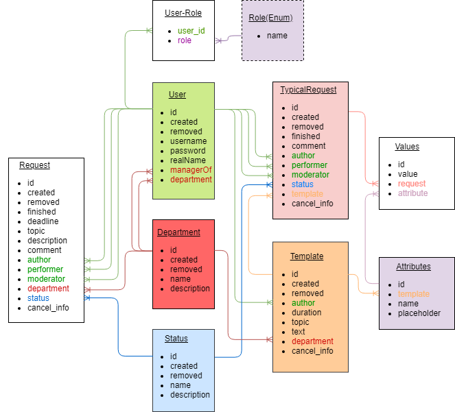

## Pages
* / - main page
* /admin - represents admin features
* /moderator - represents moderator features
* /performer - represents performer features
* /applicant - represents client features
* /request - a page to create new requests
* /login - custom login page
* /registration - temporary mapping; necessary for the application to work on a database without users
 ## API
 ### Department
#### /api/department
* Http method GET: to get all departments
* Http method POST: to create a new department
#### /api/department/{id}
* Http method GET: to get a department by id
* Http method PUT: to update a department
* Http method DELETE: to delete a department
 ### User
#### /api/user
* Http method GET: to get all users
* Http method POST: to create a new user
#### /api/user/{id}
* Http method GET: to get a user by id
* Http method PUT: to update a user
* Http method DELETE: to delete a user
### Role
#### /api/role
* Http method GET: to get all roles
### Status
#### /api/status
* Http method GET: to get all statuses
* Http method POST: to create a new status
#### /api/status/{id}
* Http method GET: to get a status by id
* Http method PUT: to update a status
* Http method DELETE: to delete a status
### Request by applicant
#### /api/applicant/request[?status={status}&department={department}]
* Http method GET: to get all requests(or filter them by status and(or) department) which were created by a logged in user 
* Http method POST: to create a new request with logged in user as an applicant
#### /api/applicant/request/{id}
* Http method PUT: to update a request(cancel it or change description)
### Request by performer
#### /api/performer/department/request
* Http method GET: to get all requests addressed to the department of the currently logged in user
#### /api/performer/request[?status={status}]
* Http method GET: to get all requests currently logged in user is assigned for as a performer(or filter them by status)
#### /api/performer/request/{id}
* Http method PUT: to update a request(change status, sigh up for it or change comment) 
### Request by Moderator
#### /api/moderator/request[?status={status}&department={department}]
* Http method GET: to get all requests(or filter them by status and(or) department) 
#### /api/moderator/request/{id}
* Http method PUT: to change a request(change status or update topic, description, comment or dealine)
* Http method DELETE: to delete a request
### Template
#### /api/template
* Http method GET: to get all templates
* Http method POST: to create a new template
#### /api/template/{id}
* Http method PUT: to update a template(remove it)
* Http method DELETE: to delete a template
### Typical request by applicant
#### /api/applicant/typicalrequest[?status={status}&department={department}]
* Http method GET: to get all typical requests(or filter them by status and(or) department) which were created by a logged in user 
* Http method POST: to create a new typical request with logged in user as an applicant
#### /api/applicant/typicalrequest/{id}
* Http method PUT: to update a typical request(cancel it)
### Request by performer
#### /api/performer/department/typicalrequest
* Http method GET: to get all typical requests addressed to the department of the currently logged in user
#### /api/performer/typicalrequest[?status={status}]
* Http method GET: to get all typical requests currently logged in user is assigned for as a performer(or filter them by status)
#### /api/performer/typicalrequest/{id}
* Http method PUT: to update a request(change status, sigh up for it or change comment)
### Typical request by Moderator
#### /api/moderator/typicalrequest[?status={status}&department={department}]
* Http method GET: to get all typical requests(or filter them by status and(or) department) 
#### /api/moderator/typicalrequest/{id}
* Http method DELETE: to delete a typical request
* Http method PUT: to update a typical request(change status or comment)

 ## Database
### Database schema

 ## UI
 ### In Progress
